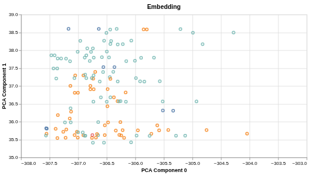
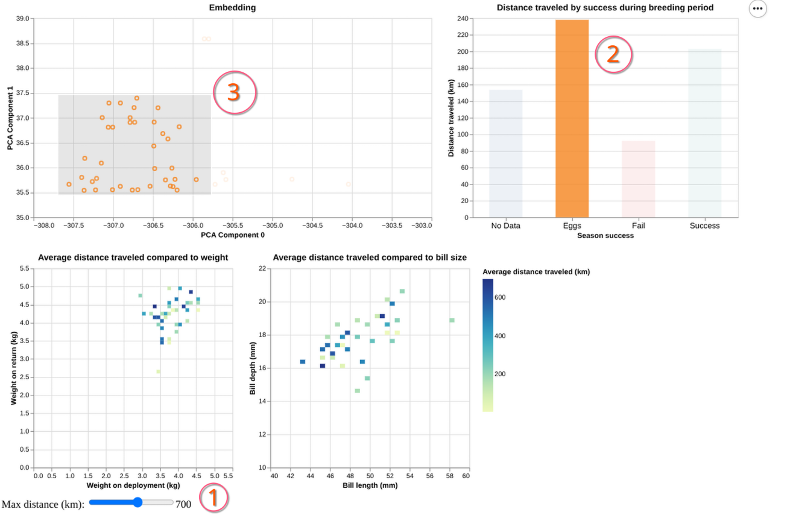

# Assignment 4

<!--
https://fmiranda.me/courses/cs424-fall-2025/assignment-4/
-->

## The dataset

**Title of the dataset:** GPS tracks of chinstrap penguins at the South Orkney Islands, 2011-2019

**Link to the source:** https://data.bas.ac.uk/full-record.php?id=GB/NERC/BAS/PDC/02019

**Dimensions:** 325x20 on the metadata table and ~1000x3 for GPS tracks of individuals.

**Attributes:**

- *Metadata:* Dep_ID, Location, Species, Date_deployed, Time_deployed, Date_retreived, Time_retreived, GPS, TDR, Bill_length [mm], Bill_depth [mm], Weight_deployment [kg], Weight_return [kg], Sex, Stage [a], Nest_on_dep [b], Nest_on_return, Notes, Nest_lat [deg N], Nest_lon [deg E].

- *GPS tracks:* DateTime, Latitude_degrees_north, Longitude_degrees_east.

**Description:** The data comprises of GPS tracks for chinstrap penguins, pygoscelid antarcticus, at the South Orkney Islands (Signy, Monroe, Powell and Laurie island) from 2011 to 2019. The dataset consists mainly of two parts. First, there is a "metadata" table detailing dates nd conditions of penguins upon attaching and retrieving GPS trackers. Secondly, there are tables of time-series of coordinates of individuals, separated by island they have been tagged on.

## Embedding construction

For the embedding ideas I researched the domain of the data, namely - animal survey and zoology. And from what I've gathered, there is little work on embedding of animal physiology, but a lot on embedding animal behavior. So, I have extracted features that would either correlate with behavior or affect behavior in some way. Here is the list wit explanation of the embedding:

- `Location_id` - an index of island colony of the individual was located. Laurie Island has index of 1, Monroe Island (a real place!) of 2, Signy Island of 3, and Signy Island, Gourlay of 4.
- `year` - year when GPS tracker was deployed.
- `month` - month when GPS tracker was deployed.
- `day` - day of the month when GPS tracker was deployed.
- `Weihgt_change` - difference between weight on deployment and weight on retrieval of the tracker.
- `path_len` - total length of path the individual took between deployment and retrieval of the tracker.
- `score` - reproductive score for the season I assigned myself. In the original dataset there are two columns indicating contents of the nest. For each record of a hatched chick the score increased by 2, for each egg by 1, and for a failed egg by 0. For the embedding I have not considered individuals without records of the nest.

The next step was data cleaning. For that I dropped every entry that has missing values. The exception of "filtering" columns was `score`, which i set to 0 for each missing entry. As the result the count of individuals decreased from 325 to 215, which is a ot, but still enough for exploration.

Initial result from that embedding were terrible, with a few outlier and a large, uncommunicative cluster. I searched on how to improve it and found the embedding needs to be normalized beforehand for more accurate clusters. The resulting vectors were then updated by using `sklearn.preprocessing.StandardScaler` to bring every feature to the same scale. This way I'm ensuring non of the components overwhelms others without good reason for it when doing dimensionality reduction with PCA.

for the final dataset, since the number of individuals was decreased drastically, I decided to just append other features to the resulting embedding. This way there is no need in pre-processing with finding common entrees, which made my life whole lot simpler pulling out all features for visualizations.

## Dimensionality reduction method

For my dimensionality reduction technique I have tapped in domain knowledge as well. As stated by one of the papers I've read, PCA is widely used for clustering/grouping in animal behavior sciences ([John Joseph Valletta, et al., 2017](https://doi.org/10.1016/j.anbehav.2016.12.005)). Since the goal of the embedding is to uncover clusters within the data, I have decided to use that. There are more examples in animal research to support that decision, but they are not relevant.

As I mentioned in previous section, the initial attempt was disappointing, but i was determined to try and fix it before jumping to other methods. And I did, which went pretty good.

As the result, it produced structurally interesting and semantically viable result:

## Encodings, interactions, and initial findings

For my visualizations, beside the embedding, I chose connected heatmaps and a box plot. Reasoning being that those are the basic visualizations required to achieve exploration goal of the project. They allow for nice and easy findings of relations between distance, physiology, and season success.

For the boxplot I had to change it into a barchart. The reason being an error which was preventing it from being connected to other plots via interactions. I have narrowed down the problem being in a data format, but nothing conclusive. I'll continue to investigate it after finals and open an issue on the Vega repository if it turns out to be a bug.

There are following interactions possible for visualizations:

1. A distance limit slider that allows to set a maximum cut-off distance to all encodings.
2. A reproductive success selection on a barchart, so when the user clicks on one of the bars, only individuals of the appropriate class.
3. A brush on the embedding, allowing to select a particular collection of individuals on the embedding.

Additionally to all that, tooltips are available on each encoding for granular data inspection.

## Interface organization

The interface features all encodings in a compact manner. For this assignment I prioritized clarity of data and was trying to give encodings enough space to be clear and avoid any cluttering. This turned out in rather spacious visualizations, but not exactly aesthetically pleasing, which i would like to work on a bit later.

The embedding, being the main visualization for the project, is placed on top-left, where eyes would naturally follow (at least mine would). Additionally, I made it wider so it's the biggest plot, emphasizing importance of it.

Besides the embedding there are median distance indicator barchart. It's placed closer to embedding so that user would be able to quickly decode meaning of color on it without relaying on a legend, saving some space.

Connected heatmaps are placed on the bottom, since they are distinct from the embedding and distance barhcart.